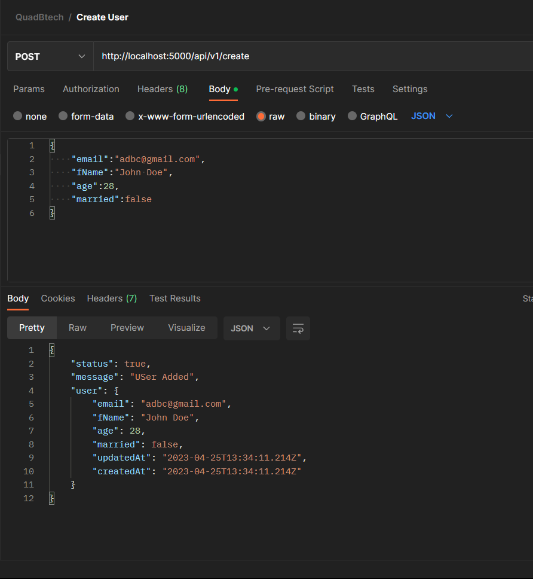

# sequelize-postgres-practice

What Learned so far?

<h2>Basics</h2>
<ul>
    <li>Installed sequelize and learned its basics</li>
    <li>Installed pg and pg-hstore for postgres</li>
    <li>Installed sequelize-cli and bootstarped the application and edited config.json file</li>
    <li>Installed postgres v14.7 on local machine from its official website</li>
    <li>Created database from terminal and pgAdmin4</li>
    <li>Created database from sequelize db:create and connected to it</li>
    
</ul>

<h2>Intermediate</h2>

<ul>
    <li>Learned how we connect with postgres dialect using sequelize</li>
    <li>Learned how we create models in sequelize</li>
</ul>

<pre>
Created a basic user registration API using Sequelize ORM + Postgres DB + Nodejs + Express
</pre>

<h3>Result</h3>

<h3>Pg admin</h3>
